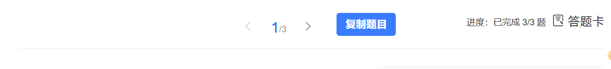

# 学堂在线习题复制助手


一个用于学堂在线(xuetangX)学习平台的用户脚本，能够在习题页面添加复制按钮，方便一键复制所有题目内容(含答案 如果有的话)。

## 免责声明

本脚本仅供学习交流使用，使用者应遵守相关平台的使用条款。作者不对因使用本脚本而产生的任何后果负责。



> 以这个为例,点击复制按钮后可以复制这三道题目

输出格式:
```text
1. 针对美国国务院白皮书和艾奇逊信件，1949年8、9月间毛泽东为新华社写了几篇评论文章。下列哪一篇不是？（单选题）
A. 《美帝国主义和一切反动派都是纸老虎》
B. 《丢掉幻想，准备斗争》
C. 《别了，司徒雷登》
D. 《“友谊”，还是侵略？》
答案：A

2. 关于解放战争时期美国对待国民党的政策，下列哪种说法不正确？（单选题）
A. 美国旨在推动建立一个统一的亲美政府
B. 为帮助国民党消灭共产党，美国不惜大规模出兵干涉
C. 给予国民党经济、政治、军备等方面的援助
D. 要求国民党实行某种程度上的改革，以实现中国在其领导下的统一
答案：B

3. 下列事件哪个不是雅尔塔体制中美苏两强安排的（单选题）
A. 《中苏友好同盟条约》的签订
B. 美国承认外蒙古独立
C. 苏联在抗战胜利后曾对中共不信任
D. 中共取得全国政权
答案：D

```

## 功能特性

- **一键复制题目**：在习题页面导航栏添加复制按钮
- **自动捕获题目数据**：通过拦截网络请求自动获取习题内容
- **格式化输出**：自动清理HTML标签，整理题目格式

## 安装方法

### Tampermonkey 浏览器扩展

1. 安装 [Tampermonkey](https://www.tampermonkey.net/) 浏览器扩展
2. 打开扩展的管理面板
3. 点击"添加新脚本"
4. 删除默认内容，将 [main.js](main.js) 中的代码粘贴进去
5. 保存脚本（Ctrl+S）
6. 点击安装按钮

## 使用说明

1. 确保已安装 Tampermonkey 扩展并启用脚本
2. 访问学堂在线学习平台
3. 进入课程的习题页面
4. 在页面导航栏中会看到"复制题目"按钮
5. 点击按钮即可复制当前页面的所有题目(如果已经做过了会复制答案)
6. 复制成功后按钮会显示"已复制"提示

## 注意事项

⚠️ **重要提醒**：

- 本脚本仅用于复制题目内容，**不支持自动答题功能**
- 脚本会自动拦截网络请求获取题目数据，请放心使用
- 如果题目数据还未加载完成，点击按钮会提示"数据未就绪"
- 支持现代浏览器Clipboard API，如果失败会自动降级到传统复制方式
- 请遵守平台使用规则，合理使用自动化工具

## 许可证

本项目采用 MIT 许可证，详见 [LICENSE](LICENSE) 文件。